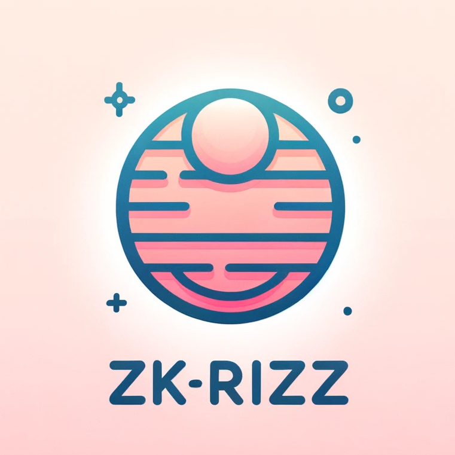

<!-- PROJECT LOGO -->
 

  

  

    zkRizz - love at first proof 😉
     
     
    <a href="#">Live 🟢</a>
    |
    <a href="https://youtu.be/kym4XXhxJOQ">View Demo 🎬</a>
    |
    <a href="#screenshots">Screenshots 📸</a>
  

<!-- TABLE OF CONTENTS -->

# Table of Contents

  <ol>
    <li><a href="#about-the-project">About The Project</a>
    </li>
    <li><a href="#usage">Usage</a></li>
    <li><a href="#built-with">Built With</a></li>
    <li><a href="#installation">Installation</a></li>
    <li><a href="#usage">Usage</a></li>
    </li>
  </ol>

<!-- ABOUT THE PROJECT -->

 

# About The Project

The promise of zk-Rizz, the web3 dating platform that uses zero knowledge proofs to verify identity and match users. Unlike other dating apps that rely on superficial swipes and filters, zk-Rizz curates profiles based on shared interests and compatibility, so you can connect with someone who truly understands you. And you don’t have to worry about your privacy, because zk-Rizz never reveals your personal information or preferences to anyone. zk-Rizz is more than just a dating app, it’s a movement to change the way we date online. Join us today and discover the power of zero knowledge, infinite love.

(<a href="#table-of-contents">back to top</a>)

# Screenshots

  
   
  
   
  
  
  

(<a href="#table-of-contents">back to top</a>)

<!-- Build Technologies -->

# Built With

-   [![React][react.js]][react-url]
-   [![Push Protocol][push]][push-protocol-url]
-   [![Covalent][covalent]][covalent-url]

(<a href="#table-of-contents">back to top</a>)

# Installation

For both app and backend environment :

1. yarn

(<a href="#table-of-contents">back to top</a>)

<!-- USAGE EXAMPLES -->

# Usage

![Architecture Diagram][architecture]

Enter the realm of zkRizz, a cutting-edge web3 dating platform revolutionizing connections. Seamlessly log in with Ethereum addresses, empowering users to define their traits and preferences. The heart of zkRizz lies in its innovative use of Zero-Knowledge Proofs, crafting a matching algorithm that pairs individuals based on genuine likes and dislikes. Transition seamlessly into anonymous messaging, fostering authentic connections beyond the constraints of conventional platforms. Explore a new era of online dating with zkRizz – where user autonomy and meaningful connections take center stage.
The user can :

1. Log into the application with you wallet.
2. Choose your own traits.
3. Choose the traits you wanna in others.
4. Let the matching algorithm match with your ideal partner.
5. Rizz your way through messages

(<a href="#table-of-contents">back to top</a>)

[next.js]: https://img.shields.io/badge/next.js-000000?style=for-the-badge&logo=nextdotjs&logoColor=white
[next-url]: https://nextjs.org/
[react.js]: https://img.shields.io/badge/React-20232A?style=for-the-badge&logo=react&logoColor=61DAFB
[react-url]: https://reactjs.org/
[connext]: https://img.shields.io/badge/-Connext-green
[connext-url]: https://www.connext.network
[push-protocol-url]: https://push.org
[push]: https://img.shields.io/badge/-Push-yellow
[covalent-url]: https://www.covalenthq.com
[covalent]: https://img.shields.io/badge/-Covalent-blue
[architecture]: images/Architecture.png
